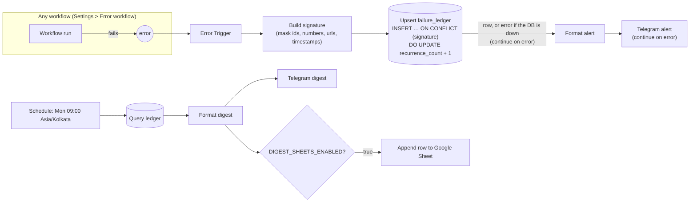
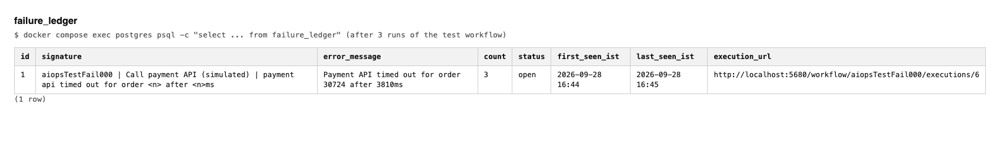
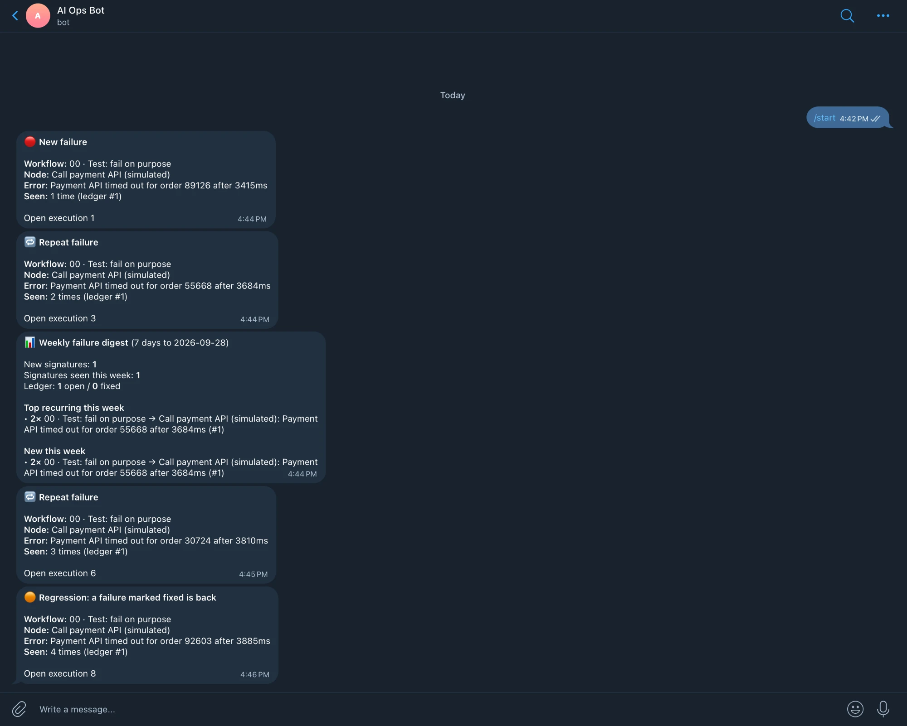

# Workflow 0: error handling and failure ledger

## Problem

Automations fail silently. A scheduled sync breaks at 3 AM, n8n marks the execution red, and nobody looks at the executions list until a customer complains. When someone does look, there is no history: is this the first time this node failed, or the fortieth?

## What it does

Every other workflow in this repo points at one **error workflow**. When any of them fails:

1. The error is turned into a **signature**: workflow id, failed node, and the message with ids, numbers, URLs, emails and timestamps masked. `order 4812 after 3021ms` and `order 77 after 3950ms` are the same bug, so they share a signature.
2. One Postgres statement writes to `failure_ledger`. A new signature inserts a row; a known one increments `recurrence_count`. If the row had been marked `fixed`, it flips back to `open`, and the alert says it is a regression.
3. A Telegram alert goes out with the workflow, node, error, how many times it has been seen, and a link to the failed execution.

Every Monday at 09:00 IST a digest summarises the week: new signatures, the most frequent ones, and open vs fixed.



### Why it can't fail itself

- **Postgres and Telegram are both set to continue on error**, with 3 tries each. Postgres runs first; if it fails, its output is the error, and the alert says `ledger write failed` and still goes out. If Telegram fails, the ledger row is already written. Both paths were tested: the ledger table was renamed mid-run, and the bot was left unstarted.
- **The Code nodes never throw.** Missing fields fall back to defaults (`unknown workflow`, `trigger`), and a payload from a trigger failure (no execution id) is handled.
- **No alert loops.** n8n does not run an error workflow for its own failures (`execute-error-workflow.js` skips `mode === 'error'` when the workflow is its own error workflow).
- **Race-safe.** The count is incremented in the same `INSERT … ON CONFLICT` statement, so two failures at the same moment cannot both insert or lose an increment.

## Files

| File | What |
|------|------|
| `workflow-error-handler.json` | Error Trigger → signature → ledger upsert → Telegram |
| `workflow-weekly-failure-digest.json` | Monday digest → Telegram, optional Google Sheets row |
| `sql/schema.sql` | `failure_ledger` table; runs automatically on first `docker compose up` |
| `test/trigger-failure.json` | Webhook that fails on purpose with a random order number |
| `test/signature.test.mjs` | Runs the real signature code from the workflow JSON against sample payloads |

## Setup

From the repo root, see [Quick start](../../README.md#quick-start) and [Configure your own alerts](../../README.md#configure-your-own-alerts). In short:

```bash
cp .env.example .env        # fill in the secrets, bot token and chat ID
./scripts/bootstrap.sh
```

To use the handler for a workflow of your own: open that workflow, then go to **⋯ → Settings → Error workflow** and pick **00 · Error handler → failure ledger**. The handler must be **published**. n8n's docs say an error workflow does not need publishing, but 2.40 refuses to run an unpublished one. `bootstrap.sh` publishes it for you.

## How to test

```bash
# 1. The signature logic alone, no n8n needed
node workflows/00-error-handling/test/signature.test.mjs

# 2. The whole loop: fail twice
curl -X POST http://localhost:5678/webhook/trigger-failure
curl -X POST http://localhost:5678/webhook/trigger-failure

# 3. One row, recurrence_count = 2
docker compose exec postgres sh -c 'psql -U "$POSTGRES_USER" -d "$POSTGRES_DB" -c "select id, signature, recurrence_count, status from failure_ledger"'

# 4. Mark it fixed, fail again: the alert says "Regression" and the row is open again
docker compose exec postgres sh -c 'psql -U "$POSTGRES_USER" -d "$POSTGRES_DB" -c "update failure_ledger set status = '"'fixed'"', fixed_at = now() where id = 1"'
curl -X POST http://localhost:5678/webhook/trigger-failure
```

To test the digest, open **00 · Weekly failure digest** in n8n and click **Execute workflow**. It uses the **Run now (test)** trigger.

## Results

The ledger after three runs of the test workflow. Each run had a different order number and duration, and all three landed on one row:



The Telegram alerts from the same test session, top to bottom: the first failure, a repeat (`Seen: 2 times`), the weekly digest run by hand, another repeat, and the regression alert after the row was marked `fixed`. Each alert's "Open execution" line links to the failed run in n8n.



## Known limits

- **Trigger failures are grouped by node, not execution.** If a workflow's trigger fails (bad credentials on a polling trigger), n8n sends no execution id or URL, so the alert has no link.
- **Signature masking is heuristic.** It masks numbers, UUIDs, hex ids, URLs, emails and ISO timestamps. A message that embeds a variable *word* (a customer name, say) creates a new signature per value. The fix is another `replace` in **Build signature**; `signature.test.mjs` should get a case for it too.
- **Every failure still alerts.** Recurrence is counted and shown, not suppressed. A workflow failing every minute sends an alert every minute. Next step: skip the Telegram node when `recurrence_count > 1` and `last_seen_at` is within N minutes.
- **The ledger shares n8n's Postgres database and user.** This keeps the demo to one `docker compose up`. In production, give the ledger its own database and a role that can only touch `failure_ledger`.
- **Env access is on.** The workflows read `$env.TELEGRAM_CHAT_ID`, which requires `N8N_BLOCK_ENV_ACCESS_IN_NODE=false`. Anything in the n8n container's environment is readable from a workflow, so secrets reach it as `*_FILE` Docker secrets instead. `$vars` would avoid this, but it needs a paid n8n plan.
- **The Google Sheets branch is only tested with the flag off.** It needs a Google OAuth credential, which can't ship in a repo.
- **Retries of an execution** (`execution.retryOf`) count as a new occurrence of the same signature.
